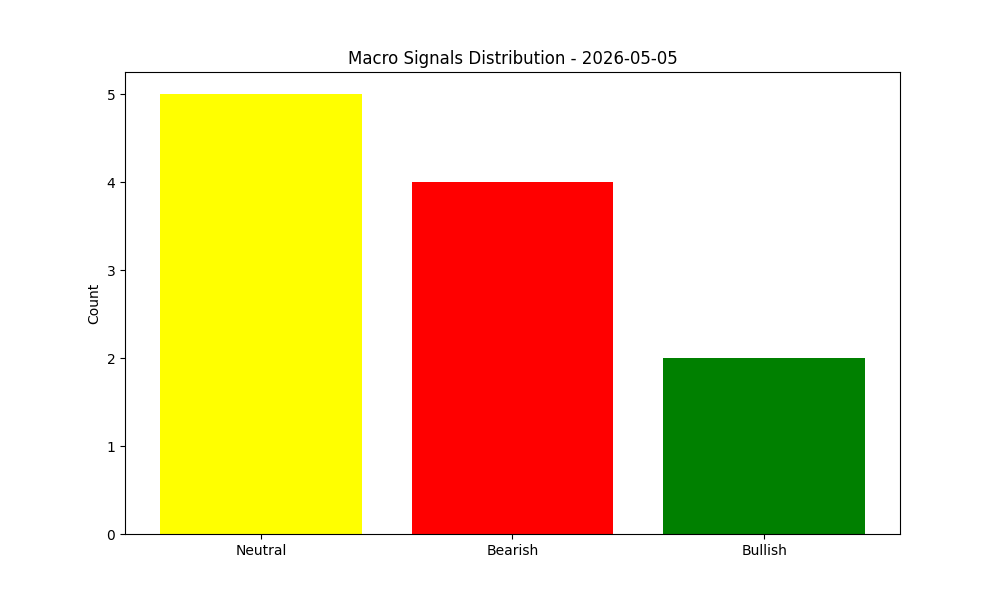

# Macro Dashboard - 2026-05-05

## Current Regime: PRE-STRESS ⚠️

### Indicator Summary

| Indicator | Value | Signal | Explanation | Data Date | Source |
|-----------|-------|--------|-------------|-----------|--------|
| 10Y Treasury Yield | 4.39 | 🟡 Neutral | Rates stable (+11.0bps over 3m) | 2026-05-01 | FRED |
| 10Y Term Premium | 0.648 | 🔴 Bearish | Elevated term premium (0.65%): investors demanding credibility compensation | 2026-04-24 | NY Fed ACM via FRED |
| 2s10s Yield Curve | 0.5 | 🟡 Neutral | Curve at 0.50%, mixed or flattening signal | 2026-05-04 | FRED |
| Fed Balance Sheet | 6699950.0 | 🟢 Bullish | Fed balance sheet expanding (+$24.6B over 4w) | 2026-04-29 | FRED |
| Bank Reserves | 2918599.0 | 🔴 Bearish | Bank reserves down $108.1B over 4w, liquidity tightening | 2026-04-29 | FRED (WRESBAL) |
| Treasury Auctions | 2.41 | 🔴 Bearish | Weak auctions: Avg BTC 2.41, max tail 5.3bps | 2026-04-08 | Treasury Fiscal Data |
| High Yield Credit Spread | 2.77 | 🟢 Bullish | HY spreads tight (277 bps) and compressing | 2026-05-01 | FRED (ICE BofA) |
| Bank Stress | -5.44 | 🔴 Bearish | Banks underperforming S&P 500 by 5.4% | 2026-05-04 | Yahoo Finance (KRE vs SPY) |
| 30Y Mortgage Rate | 6.3 | 🟡 Neutral | Mortgage rates stable (+19 bps over 3m) | 2026-04-30 | FRED (Freddie Mac) |
| Equity Breadth | 56.0 | 🟡 Neutral | Average participation: 56.0% of stocks above 200DMA | 2026-05-04 | S&P 500 (Scraped via Wikipedia/Yahoo) |
| Gold vs Real Rates | 4574.1 | 🟡 Neutral | Gold (-1.8%) aligned with real rates (-0.08%) | 2026-05-01 | Yahoo (Gold) / FRED (TIPS) |

*Auto-generated by Macro Dashboard Bot*