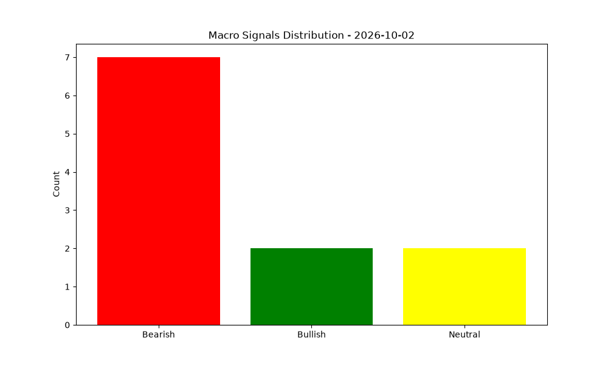

# Macro Dashboard - 2026-10-06

## Current Regime: PRE-STRESS ⚠️

### Indicator Summary

| Indicator | Value | Signal | Explanation | Data Date | Source |
|-----------|-------|--------|-------------|-----------|--------|
| 10Y Treasury Yield | 5.28 | 🔴 Bearish | Rates up 73.0bps over 3m, tightening pressure | 2026-10-02 | FRED |
| 10Y Term Premium | 1.02 | 🔴 Bearish | Elevated term premium (1.02%): investors demanding credibility compensation | 2026-09-25 | NY Fed ACM via FRED |
| 2s10s Yield Curve | 0.47 | 🔴 Bearish | Bear steepening (Spread up, 10Y up) - credibility concerns | 2026-10-05 | FRED |
| Fed Balance Sheet | 6743031.0 | 🟢 Bullish | Fed balance sheet expanding (+$5.8B over 4w) | 2026-09-30 | FRED |
| Bank Reserves | 2948090.0 | 🟢 Bullish | Bank reserves up $53.6B over 4w, liquidity easing | 2026-09-30 | FRED (WRESBAL) |
| Treasury Auctions | 2.72 | 🔴 Bearish | Weak demand (Avg of 5): BTC 2.72, Tail 3.9bps | 2026-10-06 | Treasury Fiscal Data |
| High Yield Credit Spread | 3.12 | 🟡 Neutral | HY spreads at 312 bps, stable | 2026-10-05 | FRED (ICE BofA) |
| Bank Stress | -7.02 | 🔴 Bearish | Banks underperforming S&P 500 by 7.0% | 2026-10-06 | Yahoo Finance (KRE vs SPY) |
| 30Y Mortgage Rate | 7.28 | 🔴 Bearish | Mortgage rates up 79 bps over 3m, housing headwind | 2026-10-01 | FRED (Freddie Mac) |
| Equity Breadth | 46.0 | 🟡 Neutral | Average participation: 46.0% of stocks above 200DMA | 2026-10-06 | S&P 500 (Scraped via Wikipedia/Yahoo) |
| Gold vs Real Rates | 4184.4 | 🔴 Bearish | Rising real rates (+0.50%) pressuring gold (-5.7%) | 2026-10-02 | Yahoo (Gold) / FRED (TIPS) |

*Auto-generated by Macro Dashboard Bot*