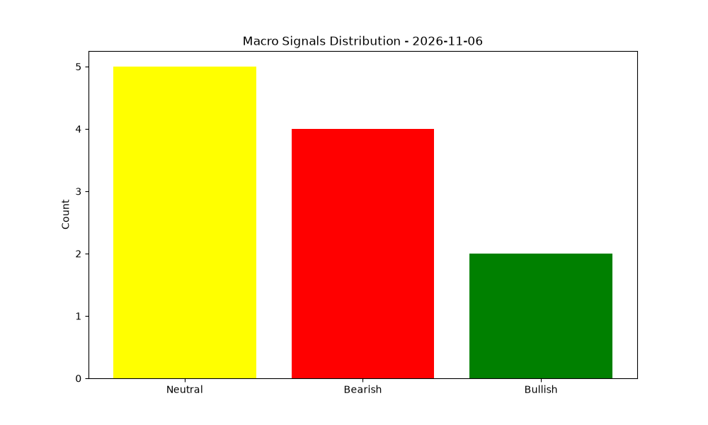

# Macro Dashboard - 2026-11-06

## Current Regime: PRE-STRESS ⚠️

### Indicator Summary

| Indicator | Value | Signal | Explanation | Data Date | Source |
|-----------|-------|--------|-------------|-----------|--------|
| 10Y Treasury Yield | 4.9 | 🟡 Neutral | Rates stable (+21.0bps over 3m) | 2026-11-04 | FRED |
| 10Y Term Premium | 0.909 | 🔴 Bearish | Elevated term premium (0.91%): investors demanding credibility compensation | 2026-10-30 | NY Fed ACM via FRED |
| 2s10s Yield Curve | 0.38 | 🟡 Neutral | Curve at 0.38%, mixed or flattening signal | 2026-11-05 | FRED |
| Fed Balance Sheet | 6748145.0 | 🟢 Bullish | Fed balance sheet expanding (+$0.6B over 4w) | 2026-11-04 | FRED |
| Bank Reserves | 2930088.0 | 🔴 Bearish | Bank reserves down $99.6B over 4w, liquidity tightening | 2026-11-04 | FRED (WRESBAL) |
| Treasury Auctions | 2.59 | 🔴 Bearish | Weak demand (Avg of 5): BTC 2.59, Tail 4.3bps | 2026-10-15 | Treasury Fiscal Data |
| High Yield Credit Spread | 3.48 | 🟡 Neutral | HY spreads at 348 bps, stable | 2026-11-05 | FRED (ICE BofA) |
| Bank Stress | 9.81 | 🟢 Bullish | Banks outperforming S&P 500 by 9.8% | 2026-11-06 | Yahoo Finance (KRE vs SPY) |
| 30Y Mortgage Rate | 7.18 | 🔴 Bearish | Mortgage rates up 51 bps over 3m, housing headwind | 2026-11-05 | FRED (Freddie Mac) |
| Equity Breadth | 62.0 | 🟡 Neutral | Average participation: 62.0% of stocks above 200DMA | 2026-11-06 | S&P 500 (Scraped via Wikipedia/Yahoo) |
| Gold vs Real Rates | 4070.9 | 🟡 Neutral | Gold (-3.4%) aligned with real rates (-0.27%) | 2026-11-04 | Yahoo (Gold) / FRED (TIPS) |

*Auto-generated by Macro Dashboard Bot*